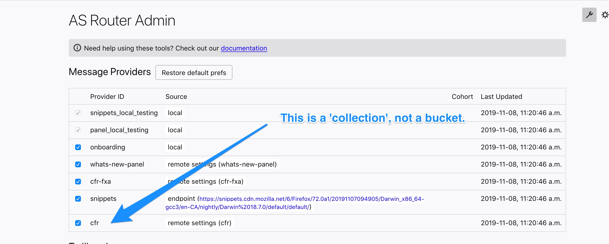

# CFR Machine Learning 

[](https://travis-ci.org/mozilla/cfr-personalization)

Table of Contents (ToC):
===========================

* [How does it work?](#how-does-it-work)
* [Building and Running tests](#build-and-run-tests)

## How does it work?

CFR instrumentation works by reading telemetry pings directly from
'live' tables.   

Those pings go through a ML pass to generate a new set of weights and
we write directly into Remote Settings.

TODO: write more about ML layer here


Some terminology is important:

In the context of Remote Settings, CFR uses the 'main' bucket.

Each 'Provider ID' in the about:newtab#devtools page is called a
'collection' in Remote Settings.

To minimize impact on production, we constrain the places where
we can write into the 'main' bucket.





CFR-Personalization will:
    * *only* operate on collections within the 'main' bucket
    * *only* write to buckets with a prefix 'cfr-exp-'
    * all writes to a collection will first be validated


## Building and running tests
You should be able to build cfr-personalization using Python 3.7

To run the testsuite, execute ::

```python
$ python setup.py develop
$ python setup.py test
```

